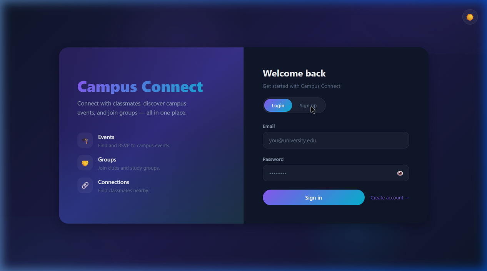
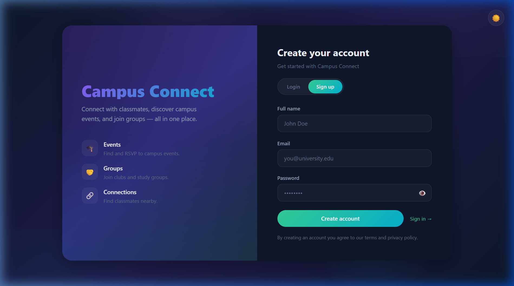

<div align="center">

# 🎓 Campus Connect

### A full-stack social platform for college students to connect, collaborate, and thrive on campus.

[](https://react.dev/)
[](https://nodejs.org/)
[](https://www.mongodb.com/)
[](https://socket.io/)
[](https://vitejs.dev/)
[](https://redux-toolkit.js.org/)

[**Live Demo**](https://campus-connect-kohl.vercel.app) &nbsp;•&nbsp; [**Report Bug**](../../issues) &nbsp;•&nbsp; [**Request Feature**](../../issues)

</div>

---

## 📸 Screenshots

<div align="center">

| Login Page | Sign Up Page |
|:---:|:---:|
|  |  |

</div>

---

## 📋 Table of Contents

- [About](#-about-the-project)
- [Features](#-features)
- [Tech Stack](#-tech-stack)
- [Architecture](#-architecture)
- [Getting Started](#-getting-started)
- [Environment Variables](#-environment-variables)
- [Project Structure](#-project-structure)
- [API Reference](#-api-reference)
- [Real-Time Events](#-real-time-events)
- [Deployment](#-deployment)
- [Contributing](#-contributing)
- [License](#-license)

---

## 🚀 About the Project

**Campus Connect** is a comprehensive campus networking platform that brings together students from the same college or university. It combines social networking, event management, group collaboration, and real-time messaging — all in one place.

Whether you need to find PG accommodations near campus, report a lost item, or just share updates with classmates — Campus Connect has you covered.

---

## ✨ Features

<table>
<tr>
<td width="50%">

### 🏠 Dashboard & Social Feed
- Create text & image posts with Cloudinary uploads
- Like and interact with posts
- Real-time feed with newest-first ordering

### 💬 Connections & Real-Time Chat
- Discover and search campus users
- Send/manage connection requests
- **Real-time messaging** with typing indicators
- Image sharing in conversations
- Online status & toast notifications

### 📅 Events
- Create, edit, and delete campus events
- Browse upcoming events
- RSVP / subscribe to events

</td>
<td width="50%">

### 👥 Groups & Clubs
- Create and manage campus groups
- Join and leave groups
- Group member management

### 🔍 Lost & Found
- Report lost or found items with images
- Browse and filter reported items
- Mark items as resolved

### 🏘️ PG & Hostel Finder
- Interactive **map view** (React Leaflet)
- Filter by type, gender, and amenities
- **Geolocation-based** discovery
- Price, rating, contact info & more

### 👤 User Profiles
- Editable profile with avatar upload
- Bio, college, phone, and profile picture

</td>
</tr>
</table>

---

## 🛠️ Tech Stack

<table>
<tr>
<td valign="top" width="50%">

### Frontend

| Technology | Purpose |
|:--|:--|
| **React 19** | UI library |
| **Redux Toolkit** | State management |
| **Vite 7** | Build tool & dev server |
| **Tailwind CSS 4** | Utility-first styling |
| **React Leaflet** | Interactive maps |
| **Socket.IO Client** | Real-time communication |
| **React Hot Toast** | Notification toasts |

</td>
<td valign="top" width="50%">

### Backend

| Technology | Purpose |
|:--|:--|
| **Node.js + Express 5** | REST API server |
| **MongoDB + Mongoose 9** | Database & ODM |
| **Socket.IO 4** | WebSocket server |
| **JWT** | Authentication |
| **bcryptjs** | Password hashing |
| **Cloudinary** | Image storage & CDN |
| **Multer** | File upload handling |

</td>
</tr>
</table>

---

## 🏗️ Architecture

```
┌─────────────────────────┐         ┌─────────────────────────┐
│    React Frontend        │         │    Express Backend        │
│   (Vite + Redux + S.IO) │◄───────►│  (REST API + Socket.IO)  │
│     Vercel Deploy        │         │     Vercel Deploy         │
└─────────────────────────┘         └───────────┬─────────────┘
                                                │
                                    ┌───────────▼─────────────┐
                                    │     MongoDB Atlas        │
                                    │      (Database)          │
                                    └───────────┬─────────────┘
                                                │
                                    ┌───────────▼─────────────┐
                                    │    Cloudinary CDN        │
                                    │   (Image Storage)        │
                                    └─────────────────────────┘
```

---

## 🏁 Getting Started

### Prerequisites

- **Node.js** ≥ 18
- **npm** ≥ 9
- [MongoDB Atlas](https://www.mongodb.com/atlas) account (or local MongoDB)
- [Cloudinary](https://cloudinary.com/) account (free tier works)

### Installation

```bash
# 1. Clone the repo
git clone https://github.com/Jagdishuikey/campus-connect.git
cd campus-connect

# 2. Install backend dependencies
cd backend
npm install

# 3. Install frontend dependencies
cd ../frontend/campus
npm install
```

### Running Locally

```bash
# Terminal 1 — Start backend
cd backend
npm run dev

# Terminal 2 — Start frontend
cd frontend/campus
npm run dev
```

Open **http://localhost:5173** in your browser.

---

## 🔐 Environment Variables

Create a `.env` file in the `backend/` directory:

```env
# MongoDB
MONGOURI=mongodb+srv://<username>:<password>@<cluster>.mongodb.net/<dbName>

# Server
PORT=3000

# JWT
JWT_SECRET=your_jwt_secret_key
JWT_EXPIRE=7d

# Cloudinary
CLOUDINARY_CLOUD_NAME=your_cloud_name
CLOUDINARY_API_KEY=your_api_key
CLOUDINARY_API_SECRET=your_api_secret

# Frontend URL (for CORS)
CLIENT_URL=https://your-frontend-url.vercel.app
```

Create a `.env` file in the `frontend/campus/` directory:

```env
VITE_API_BASE_URL=http://localhost:3000/api
```

---

## 📁 Project Structure

```
campus-connect/
│
├── backend/
│   ├── config/
│   │   ├── db.js                   # MongoDB connection
│   │   └── cloudinary.js           # Cloudinary config
│   ├── controllers/
│   │   ├── authController.js       # Auth (signup, login, profile)
│   │   ├── postController.js       # Posts CRUD + likes
│   │   ├── eventController.js      # Events CRUD
│   │   ├── groupController.js      # Groups CRUD + join/leave
│   │   ├── connectionController.js # Connections + messaging
│   │   ├── lostFoundController.js  # Lost & Found CRUD
│   │   └── pgController.js        # PG/Hostel listings
│   ├── middleware/
│   │   ├── authMiddleware.js       # JWT verification
│   │   └── upload.js               # Multer file upload
│   ├── models/
│   │   ├── UserModel.js
│   │   ├── PostModel.js
│   │   ├── EventModel.js
│   │   ├── GroupModel.js
│   │   ├── ConnectionModel.js
│   │   ├── MessageModel.js
│   │   ├── LostAndFoundModel.js
│   │   └── PGModel.js
│   ├── routes/
│   │   ├── authRoutes.js
│   │   ├── postRoutes.js
│   │   ├── eventRoutes.js
│   │   ├── groupRoutes.js
│   │   ├── connectionRoutes.js
│   │   ├── lostFoundRoutes.js
│   │   └── pgRoutes.js
│   ├── server.js                   # Entry point + Socket.IO
│   └── package.json
│
├── frontend/campus/
│   └── src/
│       ├── components/
│       │   ├── Auth.jsx            # Auth wrapper
│       │   ├── Login.jsx           # Login form
│       │   ├── Signup.jsx          # Signup form
│       │   ├── Dashboard.jsx       # Main dashboard + nav
│       │   ├── Activity.jsx        # Post feed
│       │   ├── ClubCard.jsx        # Group card
│       │   ├── ClubForm.jsx        # Group creation
│       │   ├── EventCard.jsx       # Event card
│       │   ├── EventForm.jsx       # Event creation
│       │   ├── Poll.jsx            # Poll component
│       │   ├── ThemeContext.jsx     # Dark/Light theme provider
│       │   └── ThemeToggle.jsx     # Theme toggle button
│       ├── pages/
│       │   ├── Connection.jsx      # Connections & chat
│       │   ├── Events.jsx          # Events listing
│       │   ├── Groups.jsx          # Groups listing
│       │   ├── LostFound.jsx       # Lost & Found
│       │   ├── Hostels.jsx         # PG/Hostel map
│       │   └── ProfilePage.jsx     # User profile
│       ├── services/
│       │   ├── api.js              # API service layer
│       │   └── socket.js           # Socket.IO client
│       ├── store/
│       │   ├── store.js            # Redux store
│       │   ├── authSlice.js        # Auth state
│       │   └── uiSlice.js          # UI state (navigation)
│       ├── App.jsx                 # Root component
│       ├── App.css                 # Global styles
│       └── main.jsx                # Vite entry point
│
├── assets/                         # README screenshots
├── .gitignore
└── README.md
```

---

## 📡 API Reference

### Auth

| Method | Endpoint | Description |
|:--|:--|:--|
| `POST` | `/api/auth/signup` | Register a new user |
| `POST` | `/api/auth/login` | Login with email & password |
| `POST` | `/api/auth/verify` | Verify JWT token |
| `POST` | `/api/auth/logout` | Logout |
| `PUT` | `/api/auth/profile` | Update profile info + image |

### Posts

| Method | Endpoint | Description |
|:--|:--|:--|
| `GET` | `/api/posts` | Get all posts |
| `POST` | `/api/posts` | Create post (text + image) |
| `DELETE` | `/api/posts/:id` | Delete a post |
| `PUT` | `/api/posts/:id/like` | Like / unlike a post |

### Events

| Method | Endpoint | Description |
|:--|:--|:--|
| `GET` | `/api/events` | Get all events |
| `POST` | `/api/events` | Create an event |
| `PUT` | `/api/events/:id` | Update an event |
| `DELETE` | `/api/events/:id` | Delete an event |

### Groups

| Method | Endpoint | Description |
|:--|:--|:--|
| `GET` | `/api/groups` | Get all groups |
| `POST` | `/api/groups` | Create a group |
| `PUT` | `/api/groups/:id` | Update a group |
| `DELETE` | `/api/groups/:id` | Delete a group |
| `POST` | `/api/groups/:id/join` | Join a group |
| `POST` | `/api/groups/:id/leave` | Leave a group |

### Connections & Messaging

| Method | Endpoint | Description |
|:--|:--|:--|
| `GET` | `/api/connections` | Get all connections |
| `GET` | `/api/connections/users?search=` | Search users |
| `POST` | `/api/connections` | Send connection request |
| `PUT` | `/api/connections/:id` | Accept / reject request |
| `POST` | `/api/connections/messages` | Send message (text + image) |
| `GET` | `/api/connections/messages/:userId` | Get message history |

### Lost & Found

| Method | Endpoint | Description |
|:--|:--|:--|
| `GET` | `/api/lostfound` | Get all items |
| `POST` | `/api/lostfound` | Report a lost/found item |
| `PUT` | `/api/lostfound/:id` | Update an item |
| `DELETE` | `/api/lostfound/:id` | Delete an item |

### PG / Hostels

| Method | Endpoint | Description |
|:--|:--|:--|
| `GET` | `/api/pgs` | Get all PG/Hostel listings |

### Health

| Method | Endpoint | Description |
|:--|:--|:--|
| `GET` | `/api/health` | Server health check |

---

## ⚡ Real-Time Events

Campus Connect uses **Socket.IO** for real-time features:

| Event | Direction | Description |
|:--|:--|:--|
| `register` | Client → Server | Register user identity on connect |
| `send_message` | Client → Server | Send a direct message |
| `receive_message` | Server → Client | Receive a direct message |
| `typing` | Client → Server | Typing started |
| `user_typing` | Server → Client | Typing indicator |
| `stop_typing` | Client → Server | Typing stopped |
| `user_stop_typing` | Server → Client | Stop typing indicator |
| `connection_request` | Client → Server | Connection request sent |
| `new_connection_request` | Server → Client | New connection request received |
| `user_online` | Server → All | User came online |
| `user_offline` | Server → All | User went offline |

---

## 🚀 Deployment

The project is deployed on **Vercel** as two separate projects:

1. **Frontend** → Deploy `frontend/campus` as a Vite project
2. **Backend** → Deploy `backend` as a Node.js project

### Quick Deploy Steps

1. Push code to GitHub
2. Import `backend` and `frontend/campus` as separate projects on [Vercel](https://vercel.com)
3. Add environment variables in the Vercel dashboard
4. Set `CLIENT_URL` in backend to your frontend's Vercel URL
5. Set `VITE_API_BASE_URL` in frontend to your backend's Vercel URL

---

## 🤝 Contributing

Contributions are welcome!

1. **Fork** the repository
2. **Create** a feature branch — `git checkout -b feature/amazing-feature`
3. **Commit** your changes — `git commit -m 'Add amazing feature'`
4. **Push** to the branch — `git push origin feature/amazing-feature`
5. **Open** a Pull Request

---

## 📄 License

Distributed under the **MIT License**. See `LICENSE` for more information.

---

<div align="center">

**Built with ❤️ for campus communities everywhere**

⭐ **Star this repo** if you found it useful!

</div>
